# Predict Subreddit
An NLP model that predicts subreddit based on the title of a post.

Play with it on [HuggingFace Space](https://huggingface.co/spaces/daspartho/predict-subreddit)

[Post](https://www.reddit.com/r/MachineLearning/comments/xgijzo/p_made_an_nlp_model_that_predicts_subreddit_based/) on r/MachineLearning

# Data Collection

The model was trained using the titles of the top 1000 posts from the top 125 subreddits scraped using [PRAW](https://praw.readthedocs.io/en/stable/index.html).

For steps to create the dataset check out the [dataset](https://github.com/daspartho/predict-subreddit/blob/main/dataset.ipynb) notebook in the repo or open in [Colab](https://colab.research.google.com/github/daspartho/predict-subreddit/blob/main/dataset.ipynb).

Dataset hosted [on HuggingFace](https://huggingface.co/datasets/daspartho/subreddit-posts)

# Modelling

HuggingFace Transformers' [DistilBERT](https://huggingface.co/docs/transformers/model_doc/distilbert), is fine-tuned on the [dataset](https://huggingface.co/datasets/daspartho/subreddit-posts) of post titles labelled with their respective subreddit.

For steps to make the model check out the [model](https://github.com/daspartho/predict-subreddit/blob/main/model.ipynb) notebook in the repo or open in [Colab](https://colab.research.google.com/github/daspartho/predict-subreddit/blob/main/model.ipynb).

Model hosted [on HuggingFace](https://huggingface.co/daspartho/subreddit-predictor)

# Examples
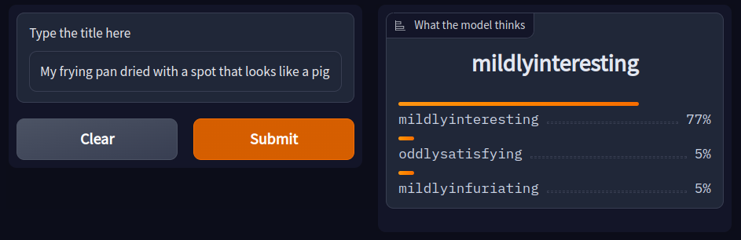
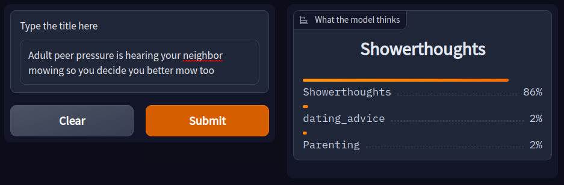
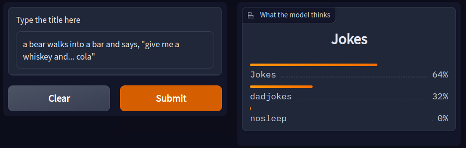
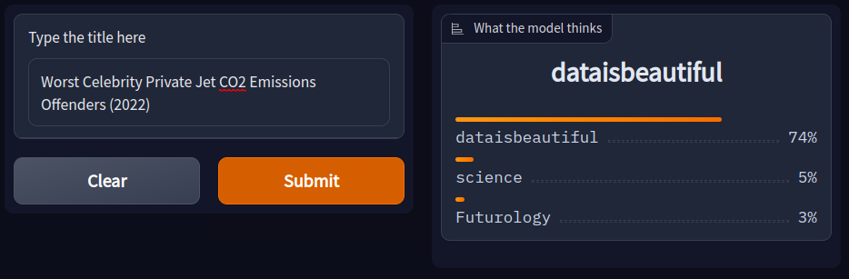
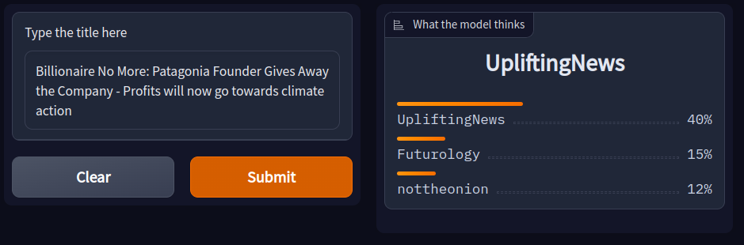
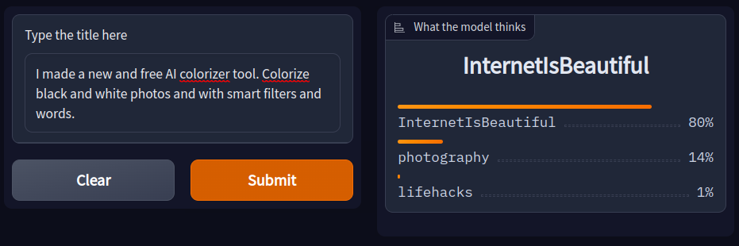
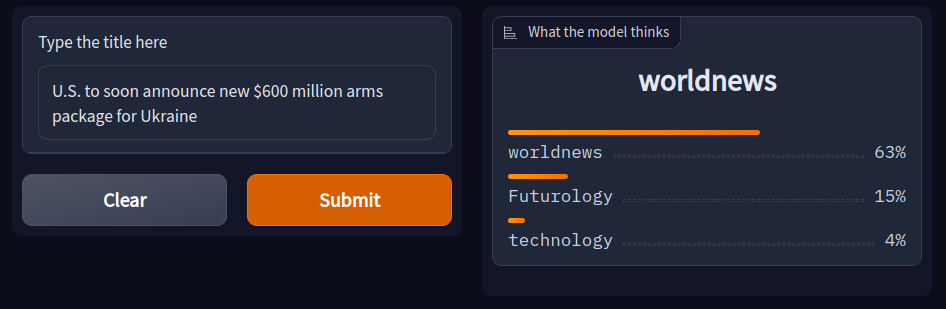
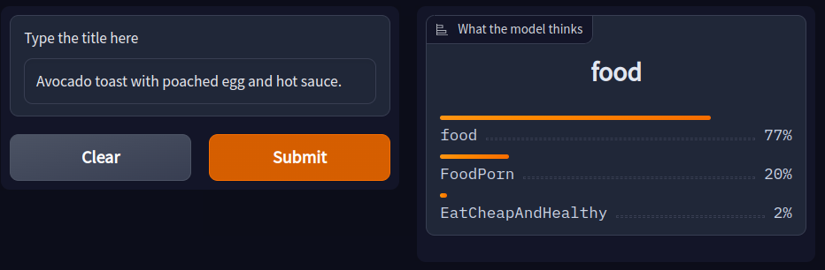
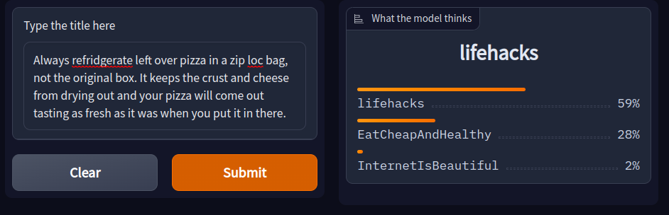
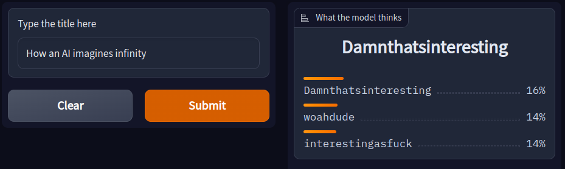
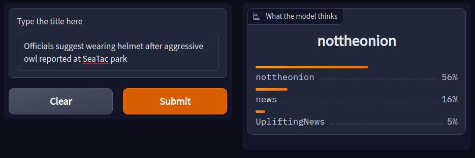
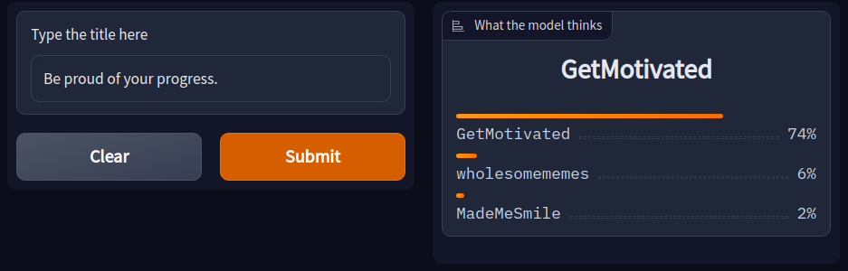
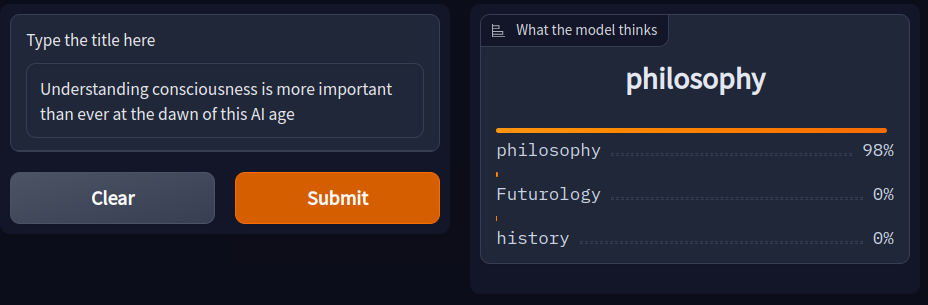
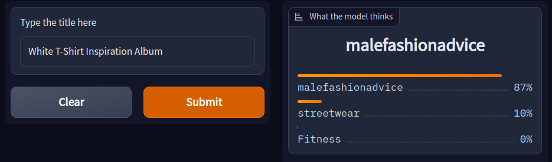
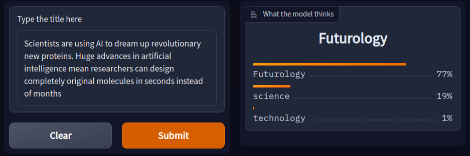

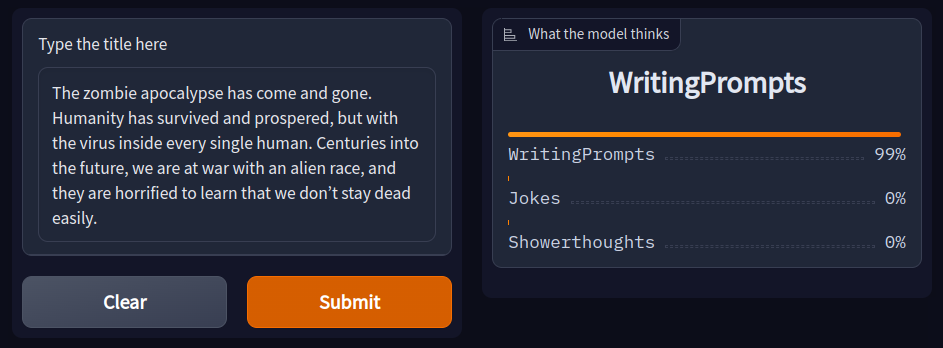

# Limitations and bias
- Since the model is trained on top 125 subreddits ([for reference](http://redditlist.com/)) therefore it can only categorise within those subreddits.
- Some subreddits have a specific format for their post title, like [r/todayilearned](https://www.reddit.com/r/todayilearned) where post title starts with "TIL" so the model becomes biased towards "TIL" --> r/todayilearned. This can be removed by cleaning the dataset of these specific terms.
- In some subreddit like [r/gifs](https://www.reddit.com/r/gifs/), the title of the post doesn't matter much, so the model performs poorly on them.

# Contributing
If you want to contribute code, simply create a pull request. If you have an idea, create an issue and the developers will look into it!
